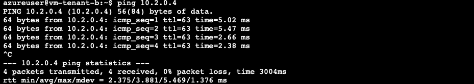
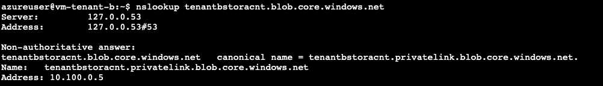
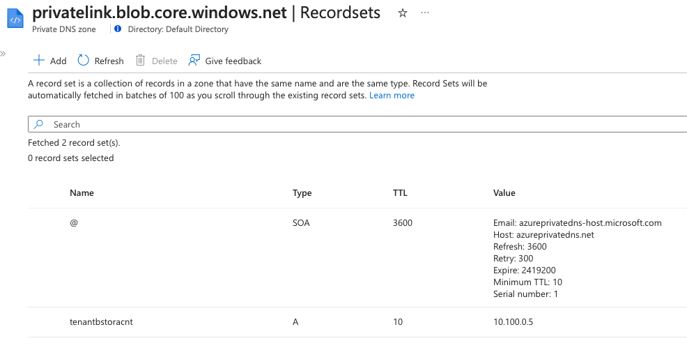
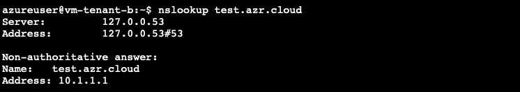

# Azure Cross-Tenant Architecture: When Tenants Talk


This is the reference implementation for enabling **cross-tenant architecture in Azure**, focused on centralizing services using **Azure Lighthouse**, **Private DNS Resolver**, and **Virtual WAN**. This repository provides AzCLI and Terraform-based deployments for both tenants and enforces governance using custom Azure Policies.


## 🚀 Introduction

This repository demonstrates how to:

- Deploy centralized DNS resolution from a single tenant
- Establish cross-tenant VNet connectivity
- Link private DNS zones across tenants
- Govern delegation with custom Azure Policies
- Validate the setup 

## 📁 Folder Structure
```
.
├── tenant-a 
│ └── Terraform code that will setup vWAN, VM & DNS resolver setup in Tenant A 
├── tenant-b 
│ └── Terraform code that will setup VM & DNS resolver setup in Tenant B 
├── azure-custom-policies 
│ └── Custom policies for delegated access control and automate creating the DNS record in the DNS zone
├── azure-lighthouse-templates 
│ └── Resource Group Template and associated parameter files for setting up Azure Lighthouse delegation (ARM templates) 
├── multi-tenant-scenarios 
| └── Terraform code to setup cross-tenant DNS zone linking and VNET connectivity 
```

## 🛠️ Prerequisites
- Azure CLI installed(v2.71.0) and authenticated to both tenants
- Contributor, Resource Policy Contributor & RBAC access to both Tenant A and Tenant B
- Terraform CLI (v1.9.8 or later)

## 🧩 Step-by-Step Usage

#### 1. Deploy Core Resources in Tenant A
```
az login --tenant <tenant_a_id>
cd tenant-a
terraform init
terraform apply -auto-approve -var tenanta_subscription_id=<tenant_a_sub_id> -var vma_admin_password=<vm_password> -var tenanta_id=<tenant_a_id>
```

This deploys below resources in Tenant A:
- Azure Private DNS Resolver
- Virtual WAN and Virtual Hub
- VM

#### 2. Deploy Workload VNet in Tenant B
```
cd ../tenant-b
terraform init
az login - tenant <tenant_b_id>
terraform apply -auto-approve -var tenantb_subscription_id=<tenant_b_sub_id> -var vmb_admin_password=<vm_password> -var tenantb_id=<tenant_b_id>
```

This deploys:
- Workload VNet
- VM
- DNS Resolver in Tenant B for testing purposes

#### 3. Apply Azure Policies
There are couple of custom policies
- **Deny-UnApproved-Auth.json** : custom policy to restrict authorization to specific tenants. (Optional)
- **Deploy-Generic-DNS.json** : custom policy to enforce private dns zone configs when a private endpoint is created (Required) . Please update the equivalent parameters file for private DNS Zone ID and the scope during policy assignment command.

```
cd ../azure-policy-definition
az login - tenant <tenant_b_id>
az policy definition create \
   --name "Deploy-DNS" \
   --display-name "Link DNS zone records to central DNS zone" \
   --rules "$(jq '.policyRule' Deploy-Generic-DNS.json)" \
   --params "$(jq '.parameters' Deploy-Generic-DNS.json)"  \
   --mode "All"
az policy assignment create 
   --name enforce-dns-zone-group \
   --display-name "Enforce Private DNS zone group assignment" \
   --scope <scope_id> \
   --policy Deploy-DNS \
   --params @Deploy-Generic-DNS.storageblob.parameters.json \
   --mi-system-assigned \
   --location eastus
```

This deploys the custom policy to enforce creation of a private DNS zone group when a private endpoint is created

#### 4. Set Up Azure Lighthouse Delegation
The parameters file will need to be updated with relevant object id's and tenant id's before running the below command.
```
cd ../azure-lighthouse-templates
az login - tenant <tenant_b_id>
az stack sub create --name lighthouse-delegations --location eastus --action-on-unmanage deleteAll --template-file rg.json --parameters rg.parameters.json --deny-settings-mode none
az login - tenant <tenant_a_id>
az stack sub create --name lighthouse-dns-delegations --location eastus --action-on-unmanage deleteAll --template-file rg.json --parameters rg-private-dns.parameters.json --deny-settings-mode none
```

This step delegates 
- access from Tenant B to Tenant A by assigning the required roles and scopes.
  - Cross Tenant link to VNET Connections
  - Cross Tenant link to Private DNS zone
- access from Tenant A to Tenant B by assigning the required roles and scopes.
  - Cross Tenant link for DNS records

#### 5. Configure Cross-Tenant Connectivity
```
cd ../multi-tenant-scenarios
terraform init
az login - tenant <tenant_a_id>
terraform apply -auto-approve -var tenanta_subscription_id=<tenant_a_sub_id> -var  tenantb_subscription_id=<tenant_b_sub_id> -var tenanta_id=<tenant_a_id> -var tenantb_id=<tenant_b_id>
```

This deploys:
- VNet-to-VNet connections across tenants via Virtual WAN
- Cross-tenant Private DNS zone links

#### 6. Create a Storage Account in Tenant B
```
az login - tenant <tenant_b_id>
storage_id=$(az storage account create \
   --name <sto_accnt_name> \
   --resource-group azure-multitenant-tenant-b-rg  \
   --location eastus \
   --sku Standard_RAGRS \
   --kind StorageV2 \
   --min-tls-version TLS1_2 \
   --allow-blob-public-access false \
   --public-network-access Disabled \
   --query id \
   --output tsv)
az network private-endpoint create \
   --connection-name stor-pl \
   --name stor-private-endpoint \
   --private-connection-resource-id $storage_id \
   --resource-group azure-multitenant-tenant-b-rg  \
   --subnet default --group-id blob \
   --vnet-name vm-spoke-tenant-b-vnet  
```

This deploys:
- Storage account in Tenant B
- Creates a Private Endpoint for that Storage Account in Tenant B without DNS zone

## ✅ Validation Steps
Once all deployments are complete, validate the setup:

#### 1. Login to VM in Tenant B and try to ping the VM in Tenant A. SUCCESS !! 🏆

Here’s an example of a successful ping from Tenant B VM to Tenant A VM:



#### 2. Perform nslookup to newly created storage account. SUCCESS !! 🏆

Here’s an example of a successful DNS query from Tenant B resolving a Private Endpoint in Tenant B but records centralized and maintained in Tenant A:




#### 3. Perform nslookup to custom domain. SUCCESS !! 🏆

Here’s an example of a successful DNS query from Tenant B resolving a custom domain thats in Tenant A:



## Clean up resources

Once you have successully completed, please ensure to delete all the resources. You can do manually or follow the below to delete all of delegations, policies and resources.

```
cd ../multi-tenant-scenarios
az login - tenant <tenant_a_id>
terraform destroy -auto-approve -var tenanta_subscription_id=<tenant_a_sub_id> -var  tenantb_subscription_id=<tenant_b_sub_id> -var tenanta_id=<tenant_a_id> -var tenantb_id=<tenant_b_id>
az stack sub delete --name lighthouse-dns-delegations --action-on-unmanage deleteAll
az login - tenant <tenant_b_id>
az policy assignment delete --name enforce-dns-zone-group
az policy definition delete --name Deploy-DNS
az network private-endpoint delete --name stor-private-endpoint  --resource-group azure-multitenant-tenant-b-rg
az storage account delete --name <sto_accnt_name> --resource-group azure-multitenant-tenant-b-rg
az stack sub delete --name lighthouse-delegations --action-on-unmanage deleteAll
cd ../tenant-b
terraform destroy -auto-approve -var tenantb_subscription_id=<tenant_b_sub_id> -var vmb_admin_password=<vm_password> -var tenantb_id=<tenant_b_id>
az login --tenant <tenant_a_id>
cd ../tenant-a
terraform destroy -auto-approve -var tenanta_subscription_id=<tenant_a_sub_id> -var vma_admin_password=<vm_password> -var tenanta_id=<tenant_a_id>
```

## 🧠 Learn More
- [Azure Lighthouse Overview](https://learn.microsoft.com/en-us/azure/lighthouse/overview)
- [Private DNS Resolver Overview](https://learn.microsoft.com/en-us/azure/dns/dns-private-resolver-overview)
- [Azure vWAN Overview](https://learn.microsoft.com/en-us/azure/virtual-wan/virtual-wan-about)
- [Azure Cross Tenant vWAN Connectivity](https://docs.azure.cn/en-us/virtual-wan/cross-tenant-vnet-az-cli)
